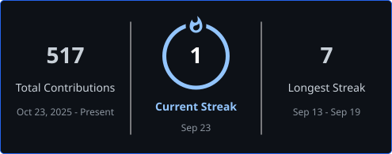

  

  

  

---

## 👋 À propos

> 🎓 Étudiant en **Bachelor Développeur Logiciel** à La Plateforme (Marseille)
>
> 💻 Je construis des projets **fullstack** de bout en bout : frontend React/Next.js, applications desktop Java, scripts &amp; jeux Python, exercices bas niveau C/C++
>
> 🚀 Toujours un nouveau projet en cours

  
  
  

---

## 🛠️ Stack technique

<!-- STACK:AUTO:START -->
### Langages
      

### Frontend & Frameworks
   

### Backend & Desktop
   

### Bases de données
 

### Outils & Déploiement
   
<!-- STACK:AUTO:END -->

---

## 📊 Statistiques GitHub

  
  

  

  

---

## 🌐 Me contacter

  <i>Ouvert aux échanges techniques et aux collaborations sur des projets.</i>

  
  
  

---

  

